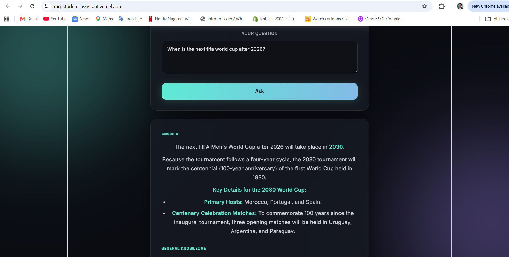

# RAG Student Assistant

An AI-powered study assistant that answers questions using Retrieval-Augmented Generation (RAG). Ask it anything from your own uploaded notes, and it retrieves the most relevant content and generates a grounded answer — with a general-knowledge fallback for questions outside your notes.

🔗 **Live demo:** https://rag-student-assistant.vercel.app

📦 **Backend API:** https://rag-student-assistant-backend.onrender.com

## Features

- Ask questions in plain English about your uploaded study materials
- Vector similarity search retrieves the most relevant document chunks before answering
- Clearly distinguishes answers grounded in your notes ("Sourced From Your Notes") from general AI knowledge
- Markdown-rendered answers (bold, lists, headers)
- Clean, animated dark-mode UI

## Tech Stack

**Frontend:** React (Vite), TypeScript, plain CSS
**Backend:** Python, FastAPI
**Database:** PostgreSQL with the pgvector extension (vector similarity search)
**AI:** Google Gemini API — `gemini-embedding-001` for embeddings, `gemini-flash-latest` for generation
**Deployment:** Vercel (frontend), Render + Docker (backend + PostgreSQL)

## How It Works

1. Documents are split into chunks and converted into vector embeddings via Gemini, then stored in PostgreSQL using pgvector.
2. When a question is asked, it's embedded the same way, and pgvector's cosine distance search finds the most semantically similar chunks.
3. If relevant chunks are found (below a distance threshold), Gemini generates an answer grounded in that context.
4. If nothing relevant is found, the assistant falls back to Gemini's general academic knowledge, and the UI clearly labels which mode answered the question.

## Running Locally

**Backend:**
```bash
python -m venv venv
.\venv\Scripts\Activate
pip install -r requirements.txt
# Set DATABASE_URL and GEMINI_API_KEY in a .env file
python setup_db.py   # enables pgvector + creates the table
python ingest.py     # embeds and stores the sample documents
uvicorn main:app --reload
```

**Frontend:**
```bash
cd frontend
npm install
npm run dev
```

## Notes

This is Project 2 of a multi-project portfolio built to prepare for Summer 2027 software engineering internship applications, with a stack (Python, TypeScript, PostgreSQL, Docker) chosen specifically to match common requirements seen in Ireland-based software engineering internships.

---
Built by [Krithik](https://github.com/Krithikezhil)